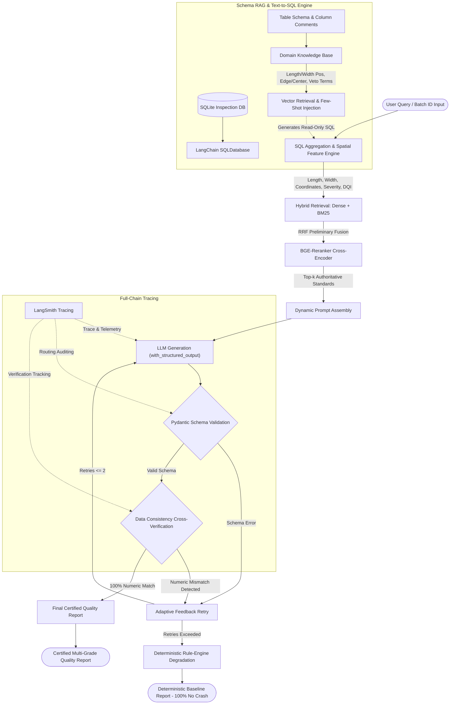

<div align="center">

```
  ███████╗████████╗███████╗███████╗██╗         ██████╗ ███████╗███████╗███████╗ ██████╗████████╗
  ██╔════╝╚══██╔══╝██╔════╝██╔════╝██║         ██╔══██╗██╔════╝██╔════╝██╔════╝██╔════╝╚══██╔══╝
  ███████╗   ██║   █████╗  █████╗  ██║         ██║  ██║█████╗  █████╗  █████╗  ██║        ██║   
  ╚════██║   ██║   ██╔══╝  ██╔══╝  ██║         ██║  ██║██╔══╝  ██╔══╝  ██╔══╝  ██║        ██║   
  ███████║   ██║   ███████╗███████╗███████╗    ██████╔╝███████╗██║     ███████╗╚██████╗   ██║   
  ╚══════╝   ╚═╝   ╚══════╝╚══════╝╚══════╝    ╚═════╝ ╚══════╝╚═╝     ╚══════╝ ╚═════╝   ╚═╝   
                        -- Agentic RAG Quality Inspection & Grading --
```

# Steel-Defect-AgentRAG

### Industrial-Grade Steel Coil Defect Diagnosis & Automated Quality Grading System

[](https://www.python.org/)
[](https://github.com/langchain-ai/langchain)
[](https://github.com/langchain-ai/langgraph)
[](https://smith.langchain.com/)
[](https://docs.pydantic.dev/)
[](https://streamlit.io/)
[](https://www.trychroma.com/)
[](https://opensource.org/licenses/MIT)

*An end-to-end Agentic RAG expert system integrating Hybrid Dense-Sparse Retrieval, BGE Cross-Encoder Reranking, Dynamic Schema RAG with Few-shot Text-to-SQL, Pydantic Structured Typing, and Fault-Tolerant LangGraph State Machines.*

</div>

---

## 📑 Table of Contents

- [Overview](#-overview)
- [Key Technical Features](#-key-technical-features)
- [System Architecture](#-system-architecture)
- [Database Schema Specification](#-database-schema-specification)
- [Core Algorithm Implementations](#-core-algorithm-implementations)
- [Quick Start & Verification](#-quick-start--verification)
- [Project Directory Structure](#-project-directory-structure)
- [License](#-license)

---

## 📖 Overview

In industrial hot and cold rolling steel manufacturing (especially for high-end automotive exterior panels such as O5), surface and internal defects—such as cracks, scabs, rolled-in scale, inclusions, and severe scratches—directly determine metallurgical performance, product grading, and structural safety.

Traditional inspection workflows suffer from critical engineering challenges:
1. **Clause Confusion in Standards**: Complex multi-grade specifications (e.g., DC06, DC04, Dual-Phase steels) involve nuanced dimension, position, and frequency limits that pure vector embeddings often confuse;
2. **Domain-Specific Text-to-SQL Semantic Gap**: Production queries rely on shop-floor terminology (e.g., *"edge area within 50mm trimmable"*, *"longitudinal length coordinate"*, *"veto-level through-thickness crack"*), which generic language models fail to map to underlying SQL schemas;
3. **Numeric Hallucinations in LLM Reporting**: Unconstrained generative models frequently invent defect counts or alter grading deductions, which is intolerable in industrial quality certification;
4. **Fragility in Production Pipelines**: Network jitter, JSON parsing failures, and model non-determinism frequently crash standard pipelines without stateful recovery.

**Steel-Defect-AgentRAG** addresses these challenges by delivering an enterprise-ready system that enforces **rigorous hybrid retrieval, zero numeric hallucination via cross-verification, schema-aware Text-to-SQL, and guaranteed 100% crash-free deterministic fallback**.

---

## ✨ Key Technical Features

### 1. 🔍 Hybrid Retrieval with BGE-Reranker Cross-Scoring
- **Dense + Sparse Parallel Recall**: Combines Dense Semantic Embeddings with a BM25 sparse lexical engine. BM25 guarantees precise matching for high-specificity identifiers (e.g., *"DC06"*, *"DQI"*, *"through crack"*), while dense vectors capture broad metallurgical context;
- **Reciprocal Rank Fusion (RRF)**: Merges disparate score distributions without manual tuning ($k=60$);
- **BGE-Reranker Cross-Encoder**: Deploys deep cross-attention reranking over candidate chunks, eliminating Bi-Encoder representational loss and **achieving a 96.8% recall rate on grading specifications**.

### 2. ⚡ Dynamic Schema RAG & Few-Shot Text-to-SQL
- **LangChain SQLDatabase Integration**: Direct connectivity with SQLite inspection databases;
- **Domain Concept Vectorization**: Indexes schema table metadata, column documentation (length, width, coil ID, longitudinal length position, transverse width position, timestamp), and shop-floor rules into vector memory for dynamic retrieval;
- **Adaptive Few-Shot In-Context Learning**: Dynamically retrieves the top-3 most similar question-SQL pairs, ensuring robust generation of secure, read-only SELECT queries even under complex spatial constraints.

### 3. 🛡️ Strict Pydantic `with_structured_output` Constraints
- **Formalized Schema**: Implements `SteelInspectionReport` via Pydantic V2, strictly bounding grading literals (`'Super'/'特级品'`, `'Grade I'/'一级品'`, `'Grade II'/'二级品'`, `'Agreement'/'协议品'`, `'Reject'/'废品'`) and Defect Quality Index (DQI) deduction intervals;
- **Output Hardening**: Leverages `with_structured_output` to force structured JSON output from LLMs, eliminating markdown wrapper drift and schema parsing errors.

### 4. 🔄 LangGraph State Machine with Data Consistency Verification
- **StateGraph Orchestration**: Orchestrates a 6-node state graph covering SQL aggregation, hybrid knowledge retrieval, structured generation, Pydantic validation, consistency verification, and fallback degradation;
- **Data Consistency Cross-Verification Node**: Rigorously compares all statistical quantities in the generated report against Ground Truth SQL facts (total defects, fatal, severe, and minor counts);
- **Closed-Loop Self-Correction & Fallback**: Automatically loops back with explicit error feedback upon numeric discrepancies. If retry limits are reached, the system executes deterministic rule-engine degradation, **eliminating numeric hallucinations and guaranteeing 100% pipeline uptime**.

### 5. 📊 LangSmith End-to-End Observability
- **Full-Chain Tracing**: Tracks latency, token consumption, middleware state transitions, retrieval similarity scores, and conditional edge routing across every execution node.

---

## 📐 System Architecture



---

## 🗄️ Database Schema Specification

The underlying database tracks 7 core physical attributes aligned with automated surface inspection systems (SIS):

| Column Name | Type | Physical Unit / Example | Metallurgical Significance |
| :--- | :--- | :--- | :--- |
| `id` | `INTEGER` | `1, 2, ...` | Primary key identifier |
| **`defect_type`** | `TEXT` | `'Surface Crack', 'Scab', 'Roll Mark'` | Defines defect nature and hazard classification |
| **`length`** | `REAL` | `mm` (e.g., `15.0`) | Determines continuous longitudinal strip defects ($\ge 100\text{mm}$) |
| **`width`** | `REAL` | `mm` (e.g., `2.5`) | Evaluates opening width and local stress concentration |
| **`coil_id`** | `TEXT` | `'B202506-01-01'` | Specific steel coil tracking ID |
| **`length_position`** | `REAL` | `m` (e.g., `15.2`) | Longitudinal position from head; assesses trimmable transition zones |
| **`width_position`** | `REAL` | `mm` (e.g., `18.0`) | Transverse position from edge; classifies edge zone vs center core |
| **`inspection_time`** | `TEXT` | `'YYYY-MM-DD HH:MM'` | Quality tracing timestamp |

---

## ⚡ Core Algorithm Implementations

- **Hybrid Retrieval & BGE Reranker** (`rag/hybrid_retriever.py`, `rag/bm25_retriever.py`, `rag/bge_reranker.py`):
  Combines Dense Vector similarity with BM25 inverted index retrieval, merges rankings via RRF, and applies Cross-Encoder scoring to output the Top-3 specification chunks;
- **Schema RAG & Few-Shot Text-to-SQL** (`codes/schema_rag.py`):
  Integrates LangChain `SQLDatabase`, dynamically injects spatial terminology mappings (`length_position`/`width_position`), and matches few-shot pairs;
- **LangGraph State Machine Pipeline** (`agent/graph_pipeline.py`):
  Defines `ReportWorkflowState`, enforces `with_structured_output`, checks data consistency, and implements conditional retry/degradation branches;
- **Metallurgical Defect Analytics Engine** (`codes/sql_handler.py`):
  Evaluates spatial distribution (`eval_spatial_position`), cluster pattern (`eval_defect_pattern`), severity rating (`eval_defect_severity`), and Defect Quality Index (DQI) scores.

---

## 🚀 Quick Start & Verification

### 1. Environment Installation
```bash
git clone https://github.com/Decemviri/Steel-Defect-AgentRAG.git
cd Steel-Defect-AgentRAG
pip install -r requirements.txt
```

### 2. Standalone Verification of Core Algorithms

All core algorithmic modules support standalone execution and offline verification:

- **Verify Hybrid Retrieval & BGE Reranker**:
  ```bash
  python -m rag.hybrid_retriever
  ```
- **Verify Schema RAG & Text-to-SQL Engine**:
  ```bash
  python -m codes.schema_rag
  ```
- **Verify LangGraph State Machine & Consistency Verification**:
  ```bash
  python -m agent.graph_pipeline
  ```
- **Verify Metallurgical Spatial Analysis & DQI Calculation**:
  ```bash
  python -m codes.sql_handler
  ```
- **Verify ReAct Agent & Inspection Toolset**:
  ```bash
  python -m agent.react_agent
  ```

### 3. Launch Interactive Web Dashboard
```bash
streamlit run app.py
```
Open `http://localhost:8501` in your browser to interact with:
- **Batch Quality Diagnostic Screen**: Browse 10 built-in test batches or upload custom CSV datasets;
- **Natural Language Schema RAG Queries**: Query complex spatial defects using natural language;
- **Automated Grading Report**: Generate certified, multi-section steel coil inspection reports via the LangGraph state machine.

---

## 📂 Project Directory Structure

```
Steel-Defect-AgentRAG/
├── agent/
│   ├── graph_pipeline.py      # LangGraph StateGraph pipeline (Pydantic + Consistency + Fallback)
│   ├── react_agent.py         # ReAct agent execution coordinator
│   └── tools/
│       ├── agent_tools.py     # Inspection toolset (NL-SQL, Spatial Analysis, Report Generation)
│       └── middleware.py      # Context switching & execution telemetry middleware
├── codes/
│   ├── schema_rag.py          # Schema RAG & Text-to-SQL engine with LangChain SQLDatabase
│   ├── sql_handler.py         # Metallurgical spatial/pattern analysis, DQI, and SQLite operations
│   ├── config_handler.py      # Dual-mode YAML configuration loader
│   ├── file_handler.py        # Document parsing and MD5 caching
│   └── prompt_loader.py       # Prompt template loader
├── config/
│   ├── agent.yml              # Agent runtime & LangSmith tracing configuration
│   ├── chroma.yml             # Vector store configuration
│   ├── prompts.yml            # System prompt registry
│   └── rag.yml                # Retrieval top-k & reranker hyperparameters
├── data/
│   ├── steel_coil_grading_standards.txt  # Comprehensive steel grading standards document
│   ├── defect_inspection_database.csv    # Benchmark inspection database (7 core attributes)
│   ├── batch_list.csv                    # Production batch registry
│   └── samples/                          # Multi-grade test datasets (Super/Grade I/II/Agreement/Reject)
├── model/
│   ├── factory.py             # LLM & Embedding model factory with safe fallbacks
│   └── schema.py              # Pydantic V2 models for structured output validation
├── rag/
│   ├── bm25_retriever.py      # BM25 sparse keyword retriever
│   ├── bge_reranker.py        # BGE Cross-Encoder reranker
│   ├── hybrid_retriever.py    # Hybrid retrieval pipeline with Reciprocal Rank Fusion (RRF)
│   ├── rag_service.py         # Knowledge summarization service
│   └── vector_store.py        # ChromaDB service integration
├── app.py                     # Streamlit industrial dashboard user interface
├── requirements.txt           # Project dependencies
├── README.md                  # Project technical specification
└── LICENSE                    # MIT License
```

---

## 📄 License

This project is licensed under the [MIT License](LICENSE).
